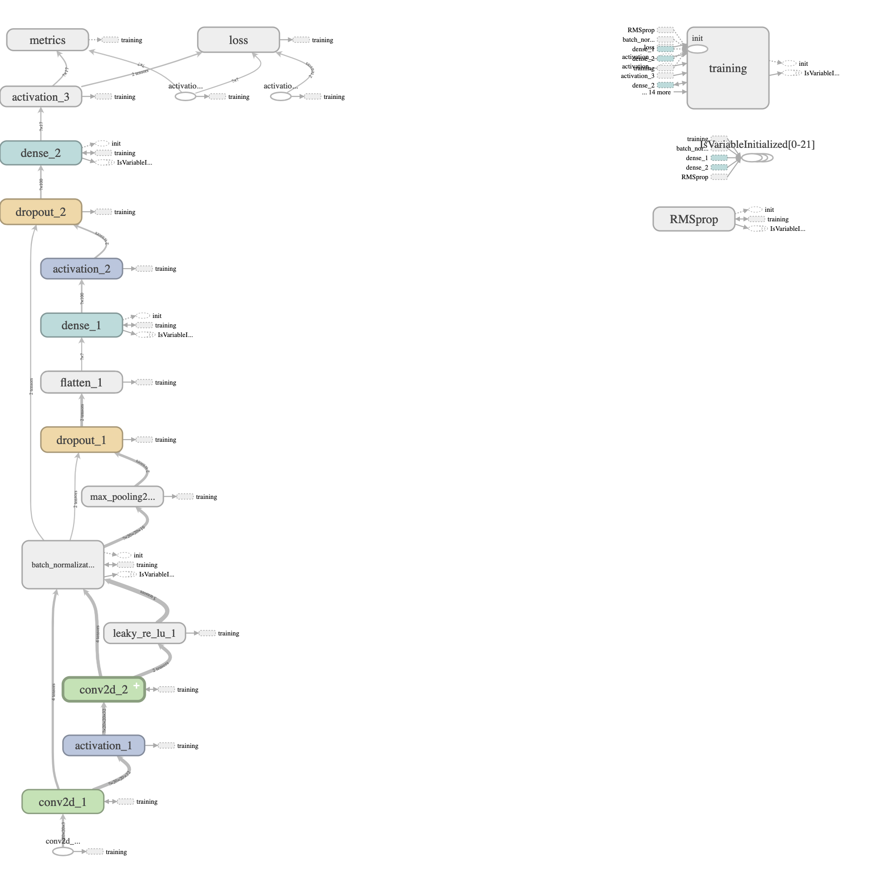
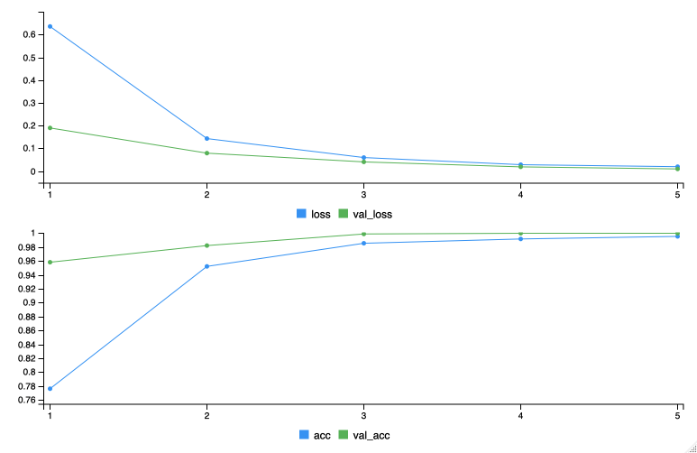
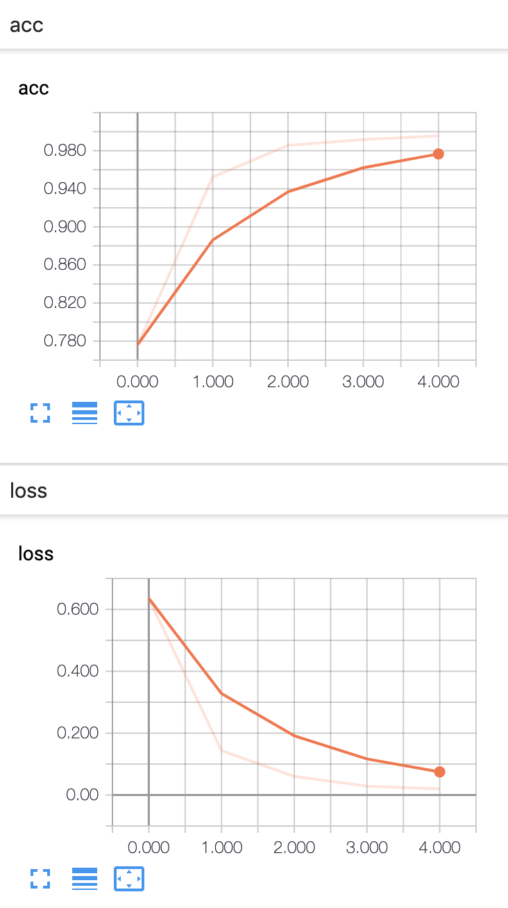
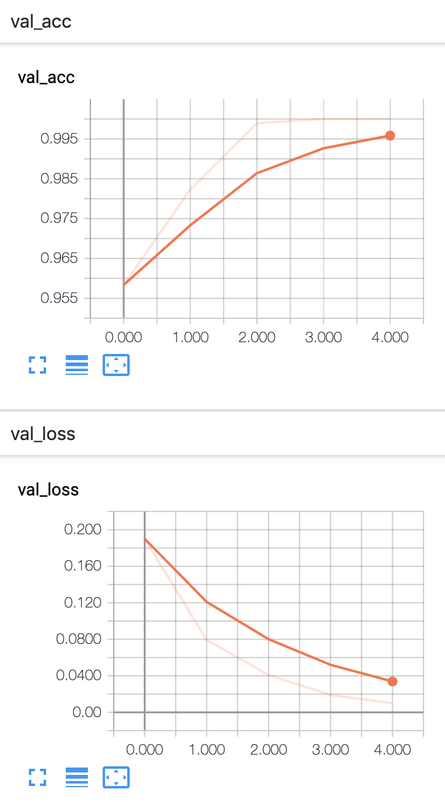
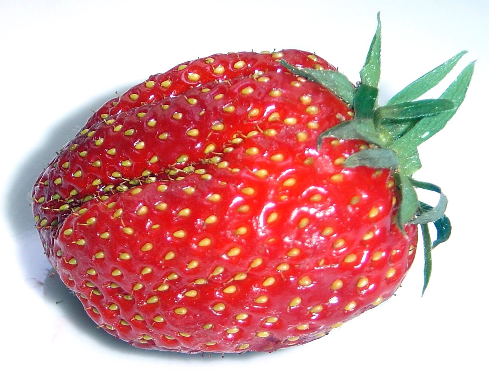
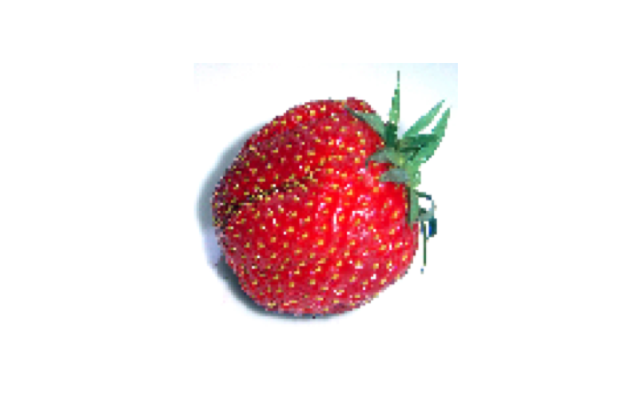
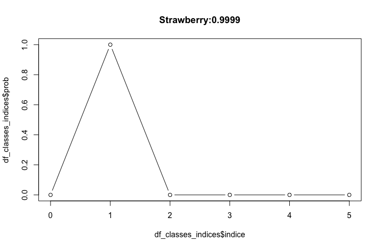

# ImageRecognitionR

### Desc

Prueba de Tenseorflow en R para el reconocimiento de imagenes. Primero con una NN simple entrenada desde cero. Luego, sumando layers a una arquitectura red ya probada.
En ambos casos, uso el modelo desarrollado para jugar clasificando imagenes tomadas desde la web.


### Data

Armo un pequeño dataset con imagenes de 6 clases de frutas a partir del de [Kaggle](https://www.kaggle.com/moltean/fruits/data).

Training

| Limes | Banana | Clementine | Strawberry | Huckleberry | Peach Flat |
|-------|--------|------------|------------|-------------|------------|
| 490   | 492    | 490        | 492        | 492         | 492        |

Validation

| Limes | Banana | Clementine | Strawberry | Huckleberry | Peach Flat |
|-------|--------|------------|------------|-------------|------------|
| 166   | 164    | 166        | 164        | 164         | 164        |

<p> &nbsp;</p>


### Scripts

0_Training_frutas.R :   

* Define las 5 clases,   
* arma el grafo del modelo y   
* lo entrena tomando lotes de imagenes desde el disco.   
* el modelo queda guardado en : fruits_model_checkpoints.h5   
<p> &nbsp;</p>

1_Pruebas_frutas.R :   

* carga el modelo de : fruits_model_checkpoints.h5   
* carga las clases de : fruits_classes_indices.RData   
* permite pasar la url de una imagen y clasificarla de acuerdo al modelo   
<p> &nbsp;</p>


### Grafo del modelo

<p align="center">
  
</p>


### Loss & Accuracy

Viewer :   

<p> &nbsp;</p>
<p align="center">
  
</p>


Tensorboard :   

<p align="center">
  
  
</p>
<p> &nbsp;</p>
<p> &nbsp;</p>


### Ejemplo

Tomo de ejemplo una frutilla de wikipedia/strawberry:

<p align="center">
  
    
</p>
<p align="center" ; style="font-size:12px">
  [Izq : Imagen original (resized)  - Der : Imagen transformada (resized) ]
</p>

<p> &nbsp;</p>


Parte de 1_Pruebas_frutas.R :   

```
> img_url <- ‘https://upload.wikimedia.org/wikipedia/commons/5/53/Strawberry_gariguette_DSC03063.JPG’ 
 ....
> paste0(rownames(df_classes_indices)[clase_pred+1],':', round(df_classes_indices[clase_pred+1,2],4) )
> plot(df_classes_indices$indice,df_classes_indices$prob, type = 'b',   main=paste0(rownames(df_classes_indices)[clase_pred+1],':', round(df_classes_indices[clase_pred+1,2],4) ))
```
> Strawberry prob :0.9999 :

<p align="center">
  
</p>
<p align="center" ; style="font-size:12px">
  [Probabilidad por clase]
</p>

<p> &nbsp;</p>


### Tags

* ImageRecognition    
* Keras    
* R    
* Tensorflow    
<p> &nbsp;</p>


### urls

https://www.youtube.com/watch?v=PicxU81owCs


